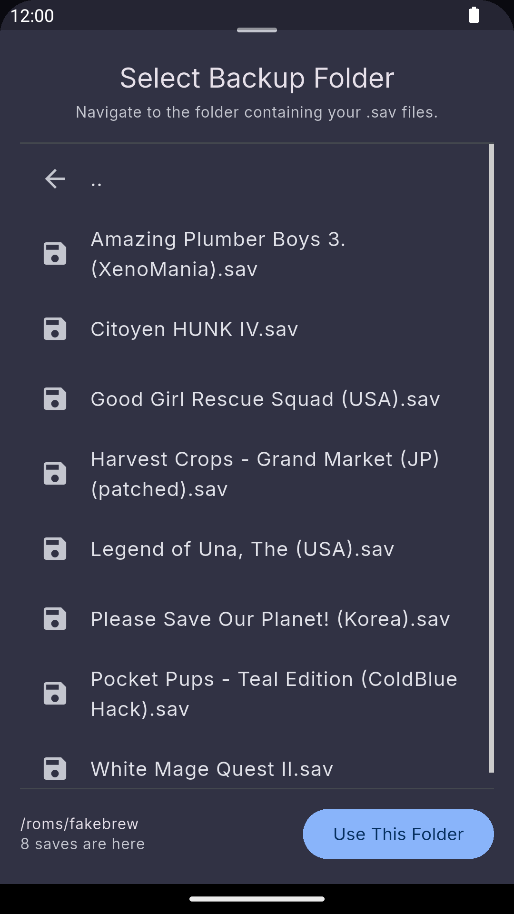
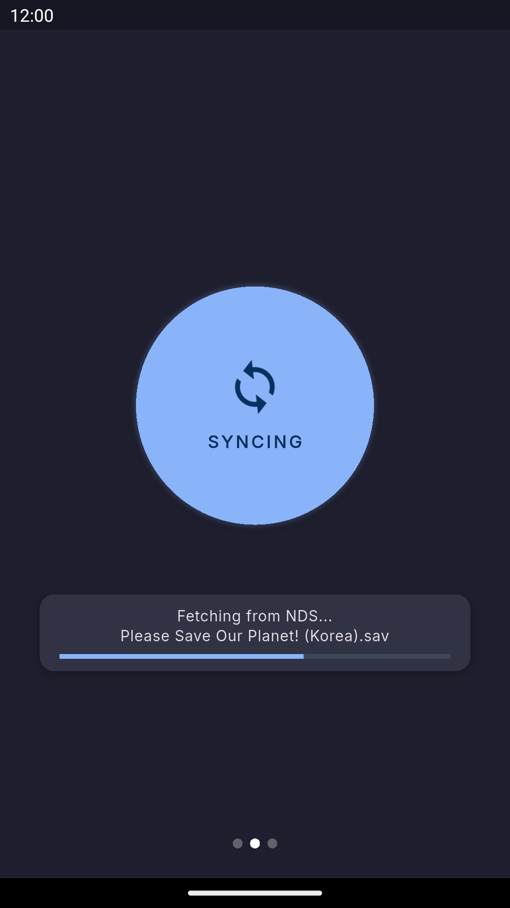
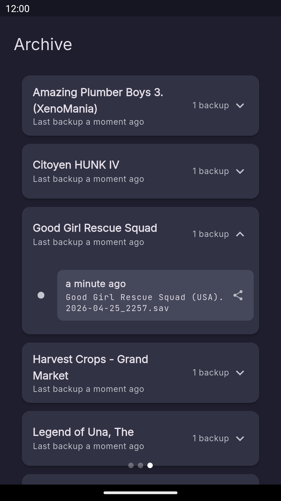

  <h1>NDS Save Sync</h1>
  
Back up and organize DS, DSi, and 3DS save files wirelessly

  

# Features

- Wirelessly back up saves from real hardware in one tap.
- Only archives changed saves.
- Preserve complete save history with built-in timeline archiving.
- Backups are stored in user-accessible folders for easy integration with Nextcloud, Google Drive, and other sync tools.

# Screenshots

<table align="center">
<tr>
<td align="center">
 
Browse Saves Wirelessly
</td>

<td align="center">
 
Sync in One Tap
</td>

<td align="center">
 
Preserve Save History
</td>
</tr>
</table>
